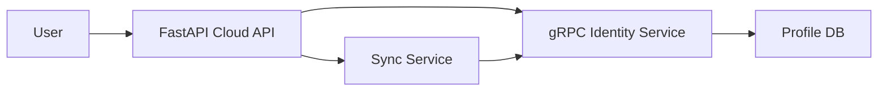

# Wellness at Work Project

## CI Status
[](https://github.com/a1nn1997/waw-testcase-backend/actions/workflows/ci.yml)

## Setup Instructions

### 1. Clone the repository:
```bash
git clone https://github.com/yourusername/wellness_at_work.git
cd wellness_at_work
```
### 2. Install dependencies:

Make sure you have Python 3.10+ installed. Then, run:

```python
pip install -r requirements.txt
```

### 3. Set up environment variables:
Create a .env file in the root directory and set the following variables:

```.env
waw_MASTER_KEY=your_master_key
PROFILE_DB_PATH=path_to_db/identity.db
CLOUD_SYNC_URL=http://localhost:8000
```

### 4. Run the Application:
Start the identity service and sync server using:
```shell
make dev
```

## Architecture Overview

This project has the following components:

gRPC Identity Service: Handles user profile management.

Sync Service: Syncs local profile data with the cloud.

Cloud API: Manages profile storage and synchronization.

### mermaid diagram


### architecture diagram


### architecture references

[ARCHITECTURE DOC MD](docs/architecture_docs_updated.md)

[ARCHITECTURE DOC HTML](docs/architecture_docs.html)

[ARCHITECTURE DOC PDF](docs/architecture.docx)

### Observed CPU/RAM Footprint

Identity Service (gRPC server): Typically uses 1-2% CPU and 100-200MB RAM in idle mode.

Sync Service: Can peak to 2% CPU and 300MB RAM during syncing.

### CI & Testing
The project uses GitHub Actions for CI:

Linting: Ensures code quality via flake8.

Tests: Executed using pytest for verification on every push to main.

## Initial recording overview
[recording](docs/screen-capture.webm)
