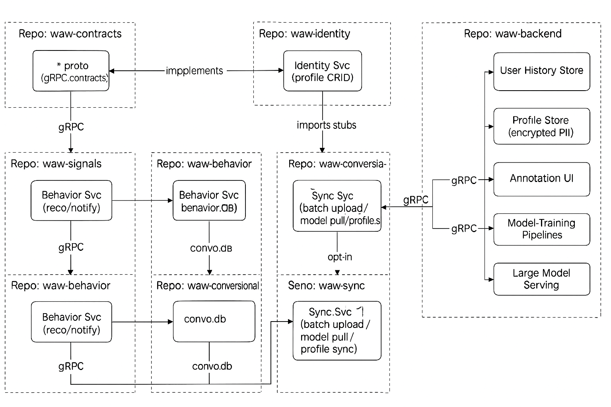

# Identity & Sync Architecture – GDPR-Compliant Profile Backup & Model Delivery

## Context and Goals

The **Wellness at Work (WaW)** desktop MVP is an offline application (PyQt UI with embedded ML) managing user profiles locally. By **Q3 2025**, we aim to:

- Enable **secure cloud backup** of user profiles.
- Provide **automatic remote ML model updates**.
- Ensure strict **GDPR compliance** (data privacy, opt-in consent, right to erasure).

The solution prioritizes simplicity, incremental deployment, and minimal engineering complexity.

**Non-Goals:**  
- No UI or local ML redesign.
- No large-scale, multi-tenant cloud infrastructure.
- User authentication beyond implicit profile identity is out-of-scope.

---

## Component Diagram

*Figure: Client-side components manage secure profile storage and sync with cloud services for backups and model updates.*

---

## Client-Side Components

- **User Interface (UI)**: Desktop UI (PyQt-based), manages user interactions with profiles.
- **Identity Service**: Handles local profile CRUD operations with an AES-256 encrypted database (`profile.db`, SQLite/SQLCipher).
- **Sync Service**: Background service for syncing profiles and fetching model updates. Checks periodically for changes and cloud updates.

## Cloud-Side Components

- **Cloud Sync API**: Lightweight REST service (FastAPI/Flask) managing profile uploads and model distribution over HTTPS.
- **Profile Backup Store**: Encrypted storage of profile data (initially a simple DB, scalable to blob storage).
- **Model Repository**: Stores and serves the latest ML model (`model.bin`).

---

## Component Interaction

- UI ↔ Identity Service: Local communication via **gRPC** (strongly typed, efficient).
- Identity Service ↔ `profile.db`: Secure local persistence.
- Sync Service → Cloud API: HTTPS REST communication, profile uploads, and model downloads.
- Cloud API ↔ Profile/Model storage: Encrypted at rest and transit.

---

## Data Flow

### Profile Backup Flow:

1. **Update:** User edits profile via UI (gRPC: `UpdateProfile`).
2. **Persist:** Identity Service saves changes in encrypted `profile.db`.
3. **Detect Change:** Sync Service detects changes (polling/file watcher).
4. **Upload:** HTTPS POST to Cloud Sync API with profile JSON.
5. **Store:** Cloud securely updates Profile Backup Store.
6. **Confirm:** API acknowledges; local sync timestamp updated.
7. **Result:** Profile securely backed up, enabling recovery/sync across devices.

### ML Model Update Flow:

1. **Check:** Sync Service regularly queries Cloud API (`GET /model/latest`).
2. **Download:** New `model.bin` received via HTTPS if available.
3. **Verify & Save:** Local integrity check (SHA-256); discard on failure, retry later.
4. **Update:** Local service loads new model at next opportunity.
5. **Rollback:** Retain previous stable model for rollback if needed.

---

## Key Design Decisions

- **Protocols:** 
  - Local: **gRPC** (clarity, efficiency).
  - Cloud: **HTTPS REST** (simplicity, compatibility).
- **Encryption:** 
  - At-rest: SQLCipher/AES-256.
  - In-transit: TLS HTTPS.
- **Reliability:** Background sync ensures resilience, with automatic retries and graceful failure handling.
- **Versioning:** Models and profiles versioned, ensuring compatibility and easy rollbacks.

---

## Privacy and GDPR Compliance

- **Explicit Consent:** Backup functionality strictly opt-in; transparent user choice required.
- **Right to Erasure:** Easy deletion of profile data both locally and in cloud.
- **Minimalism:** Only essential profile data synced; no unnecessary logs or metadata.
- **Security:** All data encrypted both at rest and in transit; audit trails maintained for transparency.

---

## Phase-in Implementation Plan

1. **Local Refactoring:**
   - Modularize Identity Service; encrypt local storage (`SQLCipher`).
   - Expose clear gRPC methods for profile management.

2. **Sync Service Development:**
   - Background process for cloud sync and model fetching.
   - Initial local development with mock Cloud API.

3. **Cloud API Implementation:**
   - Minimal REST API (`POST /profile`, `GET /model/latest`).
   - Initially simple storage backend; easily scalable later.

4. **Integration & Testing:**
   - End-to-end test scenarios (offline handling, model updates, profile sync).
   - Ensure robustness before public release.

5. **Gradual Rollout:**
   - Initially disabled for public users; enabled for beta/internal testing first.
   - Gradual feature activation reduces risk and impact.

6. **Backward Compatibility:**
   - Ensure older app versions remain functional.
   - Clear API versioning strategy.

7. **Future Enhancements:**
   - Designed for seamless incremental enhancements (e.g., authentication, scalable backend).
   - Minimal rework required for additional features.

---

This phased approach ensures a smooth and incremental integration of Identity & Sync functionality, maintaining compliance, user trust, and seamless user experience.
